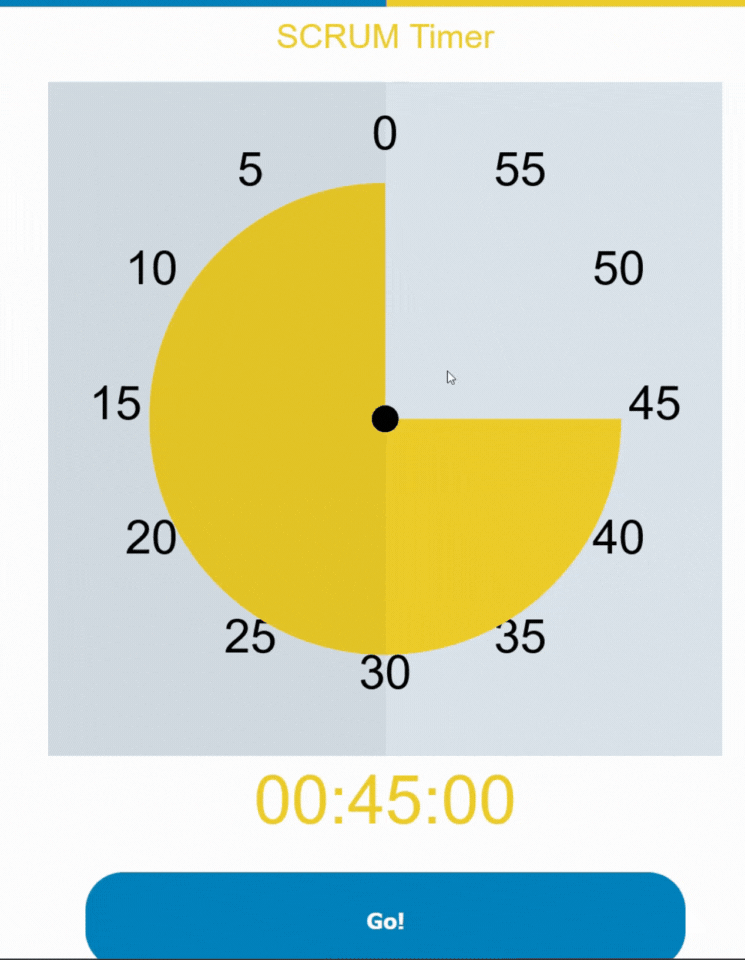

# timer.app

A simple timer for pauses in online meetings, exercises in online workhops, and timeboxing in SCRUM events.

P.S.: I don't know the initial creator.

P.P.S.: However I want to share this with the world and I'm responsible for any further development.

## Demo

## Why should you use this?

You can do whatever you want. The idea is that this timer

- Is independent of any software
- Can be used in the browser, i.e. if you only share one application window
- Can be customized with colors, names, and branding ---> after the download (haven't had the time yet)
- Is simple and fun to use
- Gives your participants a visual cue about the time left
- Can provide your participants an auditory signal as well

## Setup

Download the `timer-app.html` in your desired folder and open it in your browser. Done and done.

## Configuration

Place a file named `Alarm.mp3` in the same folder of the HTML and it will be played when timer hits 0. Remember to configure a feedback loop from your audio output to your input micro, so all participants are able to hear that sound.

## Why is this all in one file and spaghetti code?

The reason is simple: **convenience**. The timer is designed to be used by anyone regardless of their tech experience. Plus as few dependencies as possible, so pure HTML with JS magic and vanilla CSS.

## Contributions

Any kind of requests, bugs, and so on and so forth, [write a ticket](https://github.com/Dr4gon/timer.app/issues/new).

## Status

- [x] Share initial timer version with the open-source world
- [x] Write proper docu
- [ ] Clean out code
- [ ] Add color options
- [ ] Add custom sound options
- [ ] Add custom naming options
- [ ] Fry some super tasty noodles with duck
- [ ] Play piano every once in a while
- [ ] Make a random stranger laugh

### Credits

- If you made it this far in reading this doc, you deserve a laugh or two ;)
- Thank you [Zammad team](https://github.com/zammad) for inspiring me to be even more nerdy and contribute this!
- For every night spent debugging some obscure code of someone else with a decompiler, instead of simple sharing your code with me
- My family for making all of this happen, and my imaginary girlfried for her love and support
- The Universe for leading me to this exact point in time - yes, the answer is 42

### License

Thank you for not reading [MIT](LICENSE)!